# MWAA Python Dependencies Management - Private Web Server Access

## Executive Summary

For MWAA environments with `PRIVATE_ONLY` web server access, Python dependency management requires specific approaches due to network isolation constraints. This document outlines best practices and architectural solutions for enterprise migration from on-premises Airflow to MWAA.

## Current Architecture Analysis

```mermaid
graph TB
    A[🔧 Airflow Workers<br/>🏢 On-Premises Current State]
    B[⏰ Airflow Schedulers<br/>🏢 On-Premises Current State]
    C[🌐 Airflow Webserver<br/>🏢 On-Premises Current State]
    N[📦 Nexus Repository<br/>🏢 On-Premises Current State]
    P[🐍 Python Packages<br/>🏢 On-Premises Current State]
    
    MW[🔧 MWAA Workers<br/>☁️ MWAA Target State]
    MS[⏰ MWAA Schedulers<br/>☁️ MWAA Target State]
    MWS[🌐 MWAA Webserver<br/>🔒 PRIVATE_ONLY<br/>☁️ MWAA Target State]
    VE[🔗 VPC Endpoints<br/>☁️ MWAA Target State]
    S3[📦 S3 Bucket<br/>☁️ MWAA Target State]
    NR[📦 Nexus Repository<br/>🏢 On-Premises<br/>☁️ MWAA Target State]
    PP[🐍 Python Packages<br/>📄 requirements.txt<br/>☁️ MWAA Target State]
    PZ[🔌 plugins.zip<br/>☁️ MWAA Target State]
    
    A -->|📦 Package Request| N
    B -->|📦 Package Request| N
    C -->|📦 Package Request| N
    N -->|🐍 Provide Packages| P
    
    MW -->|📦 Package Request| S3
    MS -->|📦 Package Request| S3
    MWS -.->|🔗 Optional Connection| VE
    VE -.->|🏢 Hybrid Access| NR
    S3 -->|📄 Dependencies| PP
    S3 -->|🔌 Custom Code| PZ
    
    %% Styling for colorful appearance
    style A fill:#ff6b6b,stroke:#ff4757,stroke-width:3px,color:#fff
    style B fill:#ffa502,stroke:#ff6348,stroke-width:3px,color:#fff
    style C fill:#3742fa,stroke:#2f3542,stroke-width:3px,color:#fff
    style N fill:#2ed573,stroke:#20bf6b,stroke-width:4px,color:#fff
    style P fill:#a4b0be,stroke:#747d8c,stroke-width:2px,color:#fff
    
    style MW fill:#ff6b6b,stroke:#ff4757,stroke-width:3px,color:#fff
    style MS fill:#ffa502,stroke:#ff6348,stroke-width:3px,color:#fff
    style MWS fill:#3742fa,stroke:#2f3542,stroke-width:3px,color:#fff
    style S3 fill:#00d2d3,stroke:#01a3a4,stroke-width:4px,color:#fff
    style VE fill:#5f27cd,stroke:#341f97,stroke-width:3px,color:#fff
    style NR fill:#2ed573,stroke:#20bf6b,stroke-width:3px,color:#fff
    style PP fill:#a4b0be,stroke:#747d8c,stroke-width:2px,color:#fff
    style PZ fill:#fd79a8,stroke:#e84393,stroke-width:2px,color:#fff
```



## Python Dependency Installation Options for Private Web Server Access

### ✅ **Option 1: S3-Based Dependencies (Recommended)**

**🏗️ S3 Bucket Location & Configuration:**
- **Same AWS Account**: S3 bucket MUST be in same account as MWAA
- **Same Region**: S3 bucket MUST be in same region as MWAA
- **VPC Endpoint**: S3 VPC Endpoint required for PRIVATE_ONLY access
- **Bucket Policy**: Specific IAM permissions for MWAA service role

**Complete Architecture Flow:**


```mermaid
graph TB
    DEV[👨💻 Developer Laptop/EC2]
    CICD[🚀 CI/CD Pipeline<br/>🔧 CodeBuild/Jenkins]
    
    MW[👷 MWAA Workers]
    MS[⏰ MWAA Schedulers]
    MWS[🌐 MWAA Web Server<br/>🔒 PRIVATE_ONLY]
    S3VPE[🔗 S3 VPC Endpoint<br/>🌐 com.amazonaws.s3]
    
    S3[📦 S3 Bucket<br/>mwaa-dependencies-company]
    REQ[📄 requirements.txt]
    PLUG[🔌 plugins.zip]
    CONST[📝 constraints.txt]
    
    IAM[🔑 MWAA Execution Role<br/>🛡️ AmazonMWAAServiceRolePolicy]
    
    DEV -->|📤 1. Upload via AWS CLI/SDK| S3
    CICD -->|🤖 2. Automated deployment| S3
    S3 --> REQ
    S3 --> PLUG
    S3 --> CONST
    
    MW -->|🔍 3. Read via VPC Endpoint| S3VPE
    MS -->|🔍 4. Read via VPC Endpoint| S3VPE
    MWS -->|🔍 5. Read via VPC Endpoint| S3VPE
    S3VPE -->|🔒 6. Secure access| S3
    
    IAM -.->|🔑 7. Permissions| S3
    
    %% Colorful styling
    style DEV fill:#ff6b6b,stroke:#ff4757,stroke-width:3px,color:#fff
    style CICD fill:#ffa502,stroke:#ff6348,stroke-width:3px,color:#fff
    
    style MW fill:#3742fa,stroke:#2f3542,stroke-width:3px,color:#fff
    style MS fill:#5f27cd,stroke:#341f97,stroke-width:3px,color:#fff
    style MWS fill:#00d2d3,stroke:#01a3a4,stroke-width:3px,color:#fff
    style S3VPE fill:#2ed573,stroke:#20bf6b,stroke-width:3px,color:#fff
    
    style S3 fill:#fd79a8,stroke:#e84393,stroke-width:4px,color:#fff
    style REQ fill:#a4b0be,stroke:#747d8c,stroke-width:2px,color:#fff
    style PLUG fill:#ff9ff3,stroke:#f368e0,stroke-width:2px,color:#fff
    style CONST fill:#70a1ff,stroke:#5352ed,stroke-width:2px,color:#fff
    
    style IAM fill:#ff7675,stroke:#d63031,stroke-width:3px,color:#fff
```

**Detailed Sequence Flow:**


**🔧 Engineer Notes - S3 Configuration:**

**S3 Bucket Requirements:**
```yaml
# S3 Bucket Configuration
BucketName: mwaa-dependencies-<company>-prod
Region: us-east-1  # Same as MWAA
Encryption: AES-256
Versioning: Enabled
PublicAccess: Blocked

# Required Objects:
# ├── requirements.txt      (Python dependencies)
# ├── plugins.zip          (Custom packages/operators)
# ├── constraints.txt      (Version constraints)
# └── dags/               (DAG files)
```

**S3 Bucket Policy (Required):**
```json
{
  "Version": "2012-10-17",
  "Statement": [
    {
      "Effect": "Allow",
      "Principal": {
        "AWS": "arn:aws:iam::ACCOUNT:role/service-role/AmazonMWAA-MyEnvironment-XXXXX"
      },
      "Action": [
        "s3:GetObject",
        "s3:GetObjectVersion"
      ],
      "Resource": "arn:aws:s3:::mwaa-dependencies-<company>-prod/*"
    },
    {
      "Effect": "Allow",
      "Principal": {
        "AWS": "arn:aws:iam::ACCOUNT:role/service-role/AmazonMWAA-MyEnvironment-XXXXX"
      },
      "Action": "s3:ListBucket",
      "Resource": "arn:aws:s3:::mwaa-dependencies-<company>-prod"
    }
  ]
}
```

**MWAA Configuration (CloudFormation):**
```yaml
MWAAEnvironment:
  Type: AWS::MWAA::Environment
  Properties:
    Name: <company>-mwaa-prod
    SourceBucketArn: !GetAtt MWAADependenciesBucket.Arn
    RequirementsS3Path: requirements.txt
    PluginsS3Path: plugins.zip
    WebserverAccessMode: PRIVATE_ONLY
    NetworkConfiguration:
      SubnetIds:
        - !Ref MWAAPrivateSubnet1
        - !Ref MWAAPrivateSubnet2
      SecurityGroupIds:
        - !Ref MWAASecurityGroup
```

**S3 VPC Endpoint (Required for PRIVATE_ONLY):**
```yaml
S3VPCEndpoint:
  Type: AWS::EC2::VPCEndpoint
  Properties:
    VpcId: !Ref MWAAVPC
    ServiceName: !Sub 'com.amazonaws.${AWS::Region}.s3'
    VpcEndpointType: Gateway
    RouteTableIds:
      - !Ref MWAAPrivateRouteTable1
      - !Ref MWAAPrivateRouteTable2
```

**🤖 Automation Options:**

**Option A: Developer Laptop (Manual)**
```bash
# Developer workflow
aws s3 cp requirements.txt s3://mwaa-dependencies-<company>-prod/
aws s3 cp plugins.zip s3://mwaa-dependencies-<company>-prod/

# Update MWAA environment
aws mwaa update-environment --name <company>-mwaa-prod
```

**Option B: CI/CD Pipeline (Recommended)**
```yaml
# CodeBuild buildspec.yml
version: 0.2
phases:
  build:
    commands:
      - echo "Building Python dependencies"
      - pip wheel -r requirements.txt -w wheels/
      - zip -r plugins.zip plugins/
      - aws s3 cp requirements.txt s3://mwaa-dependencies-<company>-prod/
      - aws s3 cp plugins.zip s3://mwaa-dependencies-<company>-prod/
      - aws mwaa update-environment --name <company>-mwaa-prod
```

**Option C: Lambda-based Automation**
```python
# Lambda function triggered by Git webhook
import boto3

def lambda_handler(event, context):
    s3 = boto3.client('s3')
    mwaa = boto3.client('mwaa')
    
    # Download from Git, build dependencies
    # Upload to S3
    s3.upload_file('requirements.txt', 'mwaa-dependencies-<company>-prod', 'requirements.txt')
    
    # Update MWAA
    mwaa.update_environment(Name='<company>-mwaa-prod')
```

**Implementation:**
- **requirements.txt**: Standard pip requirements file uploaded to S3
- **plugins.zip**: Custom Python packages and wheels
- **constraints.txt**: Pin specific versions to avoid conflicts
- **S3 VPC Endpoint**: Mandatory for PRIVATE_ONLY web server access

### ✅ **Option 2: VPC Endpoint Service to Nexus (Advanced)**

**Detailed Architecture Flow:**

```mermaid
graph TB
    MW[🔧 MWAA Workers]
    MS[⏰ MWAA Schedulers] 
    MWS[🌐 MWAA Web Server<br/>🔒 PRIVATE_ONLY]
    VPE[🔗 VPC Endpoint<br/>🌐 nexus.company.com]
    
    VPES[🔌 VPC Endpoint Service]
    NLB[⚖️ Network Load Balancer<br/>🎯 Target: On-premises Nexus]
    DX[🌉 Direct Connect Gateway<br/>🔒 or VPN Connection]
    
    FW[🔥 Corporate Firewall]
    NR[📦 Nexus Repository<br/>🌐 nexus.company.local:8081]
    DNS[🌐 Internal DNS<br/>📋 nexus.company.com]
    
    MW -->|🔍 Package Request| VPE
    MS -->|🔍 Package Request| VPE
    MWS -->|🔍 Package Request| VPE
    VPE -.->|🔗 AWS PrivateLink| VPES
    VPES -->|⚖️ Load Balance| NLB
    NLB -.->|🌉 Direct Connect/VPN| DX
    DX -->|🔥 Firewall Rules| FW
    FW -->|📦 Repository Access| NR
    DNS -.->|🌐 DNS Resolution| NR
    
    %% Colorful styling
    style MW fill:#ff6b6b,stroke:#ff4757,stroke-width:3px,color:#fff
    style MS fill:#ffa502,stroke:#ff6348,stroke-width:3px,color:#fff
    style MWS fill:#3742fa,stroke:#2f3542,stroke-width:3px,color:#fff
    style VPE fill:#5f27cd,stroke:#341f97,stroke-width:3px,color:#fff
    
    style VPES fill:#00d2d3,stroke:#01a3a4,stroke-width:3px,color:#fff
    style NLB fill:#2ed573,stroke:#20bf6b,stroke-width:3px,color:#fff
    style DX fill:#fd79a8,stroke:#e84393,stroke-width:3px,color:#fff
    
    style FW fill:#ff7675,stroke:#d63031,stroke-width:3px,color:#fff
    style NR fill:#a4b0be,stroke:#747d8c,stroke-width:4px,color:#fff
    style DNS fill:#70a1ff,stroke:#5352ed,stroke-width:2px,color:#fff
```


**Requirements:**
- **On-premises Nexus**: Already installed in customer data center
- **Direct Connect/VPN**: Existing connection to AWS
- **Network Load Balancer**: Deploy in AWS, target on-premises Nexus
- **VPC Endpoint Service**: Create in AWS account
- **VPC Endpoint**: Create in MWAA VPC
- **DNS Configuration**: Route nexus.customer.com to VPC Endpoint
- **Security Groups**: Allow HTTPS/HTTP traffic
- **Firewall Rules**: Allow AWS NLB to reach on-premises Nexus

### ❌ **Option 3: Direct Internet Access (Not Applicable)**
Not possible with `PRIVATE_ONLY` web server access mode.

## Default MWAA Libraries

### Pre-installed Packages
MWAA comes with a base set of Python packages. To determine what's installed:

```python
# Create a DAG to list installed packages
import subprocess
import logging

def list_installed_packages():
    result = subprocess.run(['pip', 'list'], capture_output=True, text=True)
    logging.info(f"Installed packages:\n{result.stdout}")
    return result.stdout

# Use aws-mwaa-local-runner for local testing
```

### Version Compatibility Matrix

| MWAA Version | Python Version | Apache Airflow | Key Libraries |
|--------------|----------------|----------------|---------------|
| 2.8.1 | 3.11 | 2.8.1 | boto3, pandas, numpy |
| 2.7.2 | 3.10 | 2.7.2 | boto3, pandas, numpy |
| 2.6.3 | 3.10 | 2.6.3 | boto3, pandas, numpy |

## Recommended Implementation Strategy

### Phase 1: S3-Based Approach (Immediate)


### Phase 2: VPC Endpoint Service (Long-term)

**Nexus Location:** On-premises in customer's corporate data center

**Complete Architecture Flow:**


**Implementation Steps:**


## Implementation Details

### S3-Based Dependencies Configuration

**🔧 Worker/Scheduler Configuration:**
MWAA automatically configures workers and schedulers to use S3 bucket specified in environment configuration. No manual configuration required on workers.

**requirements.txt example:**
```txt
# Core data processing
pandas==1.5.3
numpy==1.24.3
requests==2.31.0

# AWS SDK (usually pre-installed, but pin version)
boto3==1.26.137
botocore==1.29.137

# Custom internal packages (via plugins.zip)
--find-links /usr/local/airflow/plugins
customer-data-utils==1.2.0

# Nexus packages (if using hybrid approach)
--index-url https://nexus.customer.com/repository/pypi-proxy/simple/
--trusted-host nexus.customer.com
customer-proprietary-lib==2.1.0
```

**constraints.txt example:**
```txt
# Pin versions to avoid conflicts with MWAA defaults
apache-airflow==2.8.1
boto3>=1.26.0,<1.27.0
pandas>=1.5.0,<2.0.0
numpy>=1.24.0,<1.25.0
```

**plugins.zip structure:**
```
plugins/
├── customer_data_utils-1.2.0-py3-none-any.whl
├── custom_operators/
│   ├── __init__.py
│   └── customer_operator.py
├── hooks/
│   ├── __init__.py
│   └── nexus_hook.py
├── sensors/
│   ├── __init__.py
│   └── customer_sensor.py
└── utils/
    ├── __init__.py
    └── customer_utils.py
```

**🚀 Automation Scripts:**

**build_dependencies.sh:**
```bash
#!/bin/bash
# Automated dependency building and upload

set -e

BUCKET="mwaa-dependencies-customer-prod"
ENVIRONMENT="customer-mwaa-prod"

echo "Building Python wheels..."
mkdir -p wheels
pip wheel -r requirements.txt -w wheels/

echo "Creating plugins.zip..."
zip -r plugins.zip plugins/

echo "Uploading to S3..."
aws s3 cp requirements.txt s3://$BUCKET/
aws s3 cp plugins.zip s3://$BUCKET/
aws s3 cp constraints.txt s3://$BUCKET/

echo "Updating MWAA environment..."
aws mwaa update-environment --name $ENVIRONMENT

echo "Deployment complete!"
```

### VPC Endpoint Service Configuration

**CloudFormation Template:**
```yaml
VPCEndpointService:
  Type: AWS::EC2::VPCEndpointService
  Properties:
    NetworkLoadBalancerArns:
      - !Ref NexusNetworkLoadBalancer
    AcceptanceRequired: false

MWAAVPCEndpoint:
  Type: AWS::EC2::VPCEndpoint
  Properties:
    VpcId: !Ref MWAAVpc
    ServiceName: !Sub 'com.amazonaws.vpce.${AWS::Region}.${VPCEndpointService}'
    VpcEndpointType: Interface
    SubnetIds:
      - !Ref MWAAPrivateSubnet1
      - !Ref MWAAPrivateSubnet2
```

## Dependency Conflict Resolution

### Testing Strategy with aws-mwaa-local-runner

```bash
# 1. Clone the local runner
git clone https://github.com/aws/aws-mwaa-local-runner.git
cd aws-mwaa-local-runner

# 2. Configure your requirements
cp your-requirements.txt docker/config/requirements.txt

# 3. Test locally
./mwaa-local-env build-image
./mwaa-local-env start

# 4. Validate dependencies
docker exec -it mwaa_local_scheduler pip list
```

### Conflict Resolution Process


## Security Considerations

### Network Security
- **VPC Endpoints**: Ensure proper security group rules
- **S3 Access**: Use VPC S3 endpoints for secure access (mandatory for PRIVATE_ONLY)
- **IAM Policies**: Least privilege access to S3 and Nexus
- **S3 Bucket Policy**: Restrict access to MWAA service role only
- **Encryption**: S3 bucket encryption with KMS keys
- **Network Isolation**: All traffic stays within AWS backbone via VPC endpoints

### Package Security
- **Vulnerability Scanning**: Scan all packages before deployment
- **Integrity Checks**: Verify package checksums
- **Version Pinning**: Pin all dependency versions

## Monitoring and Troubleshooting

### CloudWatch Metrics
- Monitor MWAA environment health
- Track dependency installation failures
- Set up alerts for package conflicts

### Troubleshooting Common Issues

| Issue | Symptom | Solution |
|-------|---------|----------|
| Package not found | Import errors in DAGs | Add to requirements.txt or plugins.zip |
| Version conflicts | Runtime errors | Pin specific versions |
| Network timeouts | Installation failures | Check VPC endpoints |
| Large package size | Slow startup | Optimize plugins.zip |

## Cost Optimization

### S3 Storage Costs
- Use S3 Intelligent Tiering for requirements files
- Compress plugins.zip files
- Regular cleanup of old versions

### VPC Endpoint Costs
- Monitor data transfer costs
- Consider Regional vs AZ endpoints
- Optimize for usage patterns


### 🔍 How to Discover Pre-installed Packages

**🔧 Engineer Notes - Package Discovery Methods:**

**Method 1: Create Discovery DAG** ⭐ **Best for Production Environments**

### 🎨 **DAG Installation & Execution Architecture**

```mermaid
sequenceDiagram
    participant Dev as 👨‍💻 Developer
    participant Git as 📚 Git Repository
    participant S3 as 📦 S3 DAG Bucket
    participant MWAA as 🚁 MWAA Environment
    participant Scheduler as ⏰ Airflow Scheduler
    participant Worker as 🔧 Airflow Worker
    participant WebUI as 🌐 Airflow Web UI
    participant CW as 📊 CloudWatch Logs
    
    Note over Dev,CW: 🚀 Phase 1: DAG Development & Deployment
    
    Dev->>Git: 1. Create discover_packages.py
    Note right of Dev: DAG Definition:<br/>• Python file with DAG object<br/>• PythonOperator for pip list<br/>• Schedule: None (manual trigger)<br/>• Logging configuration
    
    Dev->>Git: 2. Commit & Push DAG
    Note right of Git: DAG Code Structure:<br/>from airflow import DAG<br/>from airflow.operators.python import PythonOperator<br/>def list_packages(): subprocess.run(['pip', 'list'])
    
    Git->>S3: 3. Deploy to S3 DAG Bucket
    Note right of S3: S3 Bucket Structure:<br/>s3://mwaa-dags-customer-prod/<br/>├── discover_packages.py<br/>├── other_dags/<br/>└── __pycache__/
    
    S3->>MWAA: 4. MWAA Auto-detects New DAG
    Note right of MWAA: MWAA Environment:<br/>• Polls S3 every 30 seconds<br/>• Validates DAG syntax<br/>• Imports Python modules<br/>• Updates DAG registry
    
    MWAA->>Scheduler: 5. DAG Registered in Scheduler
    Note right of Scheduler: Scheduler Process:<br/>• DAG appears in UI<br/>• Schedule: None (manual only)<br/>• Status: Available for trigger<br/>• Dependencies: Validated
    
    Note over Dev,CW: ⚡ Phase 2: Manual DAG Execution
    
    Dev->>WebUI: 6. Access Airflow Web UI
    Note right of WebUI: PRIVATE_ONLY Access:<br/>• VPC-only access (no internet)<br/>• IAM authentication required<br/>• HTTPS endpoint in private subnet<br/>• URL: https://mwaa-webserver-xxx.airflow.region.amazonaws.com
    
    WebUI->>Dev: 7. Show Available DAGs
    Note right of Dev: DAG List View:<br/>• discover_mwaa_packages<br/>• Status: Ready<br/>• Last Run: Never<br/>• Schedule: None
    
    Dev->>WebUI: 8. Trigger DAG Manually
    Note right of WebUI: Manual Trigger:<br/>• Click "Trigger DAG" button<br/>• Optional: Add run configuration<br/>• Creates DAG Run instance<br/>• Assigns unique run_id
    
    WebUI->>Scheduler: 9. Create DAG Run
    Note right of Scheduler: DAG Run Creation:<br/>• run_id: manual__2024-01-15T10:30:00<br/>• state: running<br/>• execution_date: 2024-01-15T10:30:00<br/>• Tasks queued for execution
    
    Scheduler->>Worker: 10. Queue Task for Execution
    Note right of Worker: Task Queuing:<br/>• Task: list_packages<br/>• Queue: default<br/>• Priority: normal<br/>• Worker assignment: automatic
    
    Note over Dev,CW: 🔍 Phase 3: Package Discovery Execution
    
    Worker->>Worker: 11. Execute pip list Command
    Note right of Worker: Task Execution Environment:<br/>• Python 3.11 (MWAA 2.8.1)<br/>• Virtual environment: /usr/local/airflow<br/>• Command: subprocess.run(['pip', 'list'])<br/>• Capture stdout and stderr
    
    Worker->>Worker: 12. Process Package List
    Note right of Worker: Package Processing:<br/>• Parse pip list output<br/>• Format for logging<br/>• Include version numbers<br/>• Add timestamp and metadata
    
    Worker->>CW: 13. Log Results to CloudWatch
    Note right of CW: CloudWatch Logging:<br/>• Log Group: /aws/amazonmwaa/customer-mwaa-prod<br/>• Log Stream: dag_id=discover_packages/run_id=manual__xxx<br/>• Log Level: INFO<br/>• Content: Complete package list with versions
    
    Worker->>Scheduler: 14. Report Task Success
    Note right of Scheduler: Task Completion:<br/>• Task state: success<br/>• Duration: ~30 seconds<br/>• Return value: package list string<br/>• Logs: Available in CloudWatch
    
    Scheduler->>WebUI: 15. Update DAG Run Status
    Note right of WebUI: UI Status Update:<br/>• DAG Run: success<br/>• Task: list_packages (green)<br/>• Duration: 00:00:30<br/>• Logs: Click to view
    
    Note over Dev,CW: 📊 Phase 4: Results Access & Analysis
    
    Dev->>WebUI: 16. View Task Logs in UI
    Note right of WebUI: Airflow UI Logs:<br/>• Real-time log streaming<br/>• Syntax highlighting<br/>• Download log files<br/>• Filter by log level
    
    Dev->>CW: 17. Access CloudWatch Logs
    Note right of CW: CloudWatch Features:<br/>• Log retention: 30 days default<br/>• Search and filter capabilities<br/>• Export to S3 for long-term storage<br/>• CloudWatch Insights queries
    
    CW->>Dev: 18. Package Inventory Results
    Note right of Dev: Discovered Packages:<br/>• apache-airflow==2.8.1<br/>• boto3==1.34.x<br/>• pandas==2.0.x<br/>• numpy==1.24.x<br/>• 200+ total packages
    
    Note over Dev,CW: 🔄 Phase 5: Automated Scheduling (Optional)
    
    Dev->>Git: 19. Update DAG for Automation
    Note right of Git: Schedule Configuration:<br/>schedule_interval='@weekly'<br/>or<br/>schedule_interval=cron('0 2 * * 1')<br/>catchup=False
    
    Git->>S3: 20. Deploy Updated DAG
    S3->>MWAA: 21. Auto-update DAG Definition
    MWAA->>Scheduler: 22. Schedule Weekly Runs
    Note right of Scheduler: Automated Execution:<br/>• Runs every Monday at 2 AM<br/>• No manual intervention needed<br/>• Results logged to CloudWatch<br/>• Package inventory stays current
```



### 🏗️ **DAG Architecture Components**

```mermaid
graph TB
    subgraph "Development Environment"
        DEV[👨‍💻 Developer Workstation]:::dev
        IDE[💻 VS Code / PyCharm]:::dev
        GIT[📚 Git Repository]:::dev
    end
    
    subgraph "AWS S3 Storage"
        S3BUCKET[📦 S3 DAG Bucket<br/>mwaa-dags-customer-prod]:::s3
        DAGFILE[📄 discover_packages.py]:::s3
        PLUGINS[🔌 plugins.zip]:::s3
        REQS[📋 requirements.txt]:::s3
    end
    
    subgraph "MWAA Environment - Private Subnets"
        SCHEDULER[⏰ Airflow Scheduler<br/>• DAG parsing<br/>• Task scheduling<br/>• Dependency resolution]:::scheduler
        WEBSERVER[🌐 Airflow Web Server<br/>• PRIVATE_ONLY access<br/>• DAG management UI<br/>• Log viewing]:::webserver
        WORKER[🔧 Airflow Worker<br/>• Task execution<br/>• Package discovery<br/>• pip list command]:::worker
        
        PYTHON[🐍 Python 3.11 Runtime]:::runtime
        PACKAGES[📦 Pre-installed Packages<br/>• Apache Airflow 2.8.1<br/>• boto3, pandas, numpy<br/>• 200+ libraries]:::runtime
        VENV[🏠 Virtual Environment<br/>/usr/local/airflow]:::runtime
    end
    
    subgraph "AWS CloudWatch"
        LOGGROUP[📊 Log Group<br/>/aws/amazonmwaa/customer-mwaa-prod]:::logs
        LOGSTREAM[📝 Log Stream<br/>dag_id=discover_packages]:::logs
        METRICS[📈 CloudWatch Metrics<br/>• DAG success rate<br/>• Task duration<br/>• Error counts]:::logs
    end
    
    subgraph "Access & Monitoring"
        CONSOLE[🖥️ AWS Console<br/>• MWAA management<br/>• CloudWatch access]:::access
        CLI[⌨️ AWS CLI<br/>• DAG deployment<br/>• Log retrieval]:::access
    end
    
    DEV -->|📝 Code Development| IDE
    IDE -->|📤 Version Control| GIT
    GIT -->|🚀 Deploy DAGs| S3BUCKET
    S3BUCKET -->|📄 DAG Files| DAGFILE
    S3BUCKET -->|🔌 Plugin Files| PLUGINS
    S3BUCKET -->|📋 Dependencies| REQS
    
    DAGFILE -->|📅 Schedule Tasks| SCHEDULER
    SCHEDULER -->|🌐 Web Interface| WEBSERVER
    SCHEDULER -->|🔧 Execute Tasks| WORKER
    
    WORKER -->|🐍 Runtime Environment| PYTHON
    PYTHON -->|📦 Package Access| PACKAGES
    PYTHON -->|🏠 Isolated Environment| VENV
    
    WORKER -->|📝 Task Logs| LOGGROUP
    LOGGROUP -->|📊 Structured Logs| LOGSTREAM
    LOGGROUP -->|📈 Performance Data| METRICS
    
    WEBSERVER -->|🖥️ Management UI| CONSOLE
    LOGGROUP -->|📊 Monitoring| CONSOLE
    CLI -->|🚀 Automated Deploy| S3BUCKET
    CLI -->|📝 Log Access| LOGGROUP
    
    classDef dev fill:#FF6B6B,stroke:#FF4757,stroke-width:3px,color:#fff
    classDef s3 fill:#4ECDC4,stroke:#26D0CE,stroke-width:3px,color:#fff
    classDef scheduler fill:#45B7D1,stroke:#3742FA,stroke-width:3px,color:#fff
    classDef webserver fill:#96CEB4,stroke:#6C5CE7,stroke-width:3px,color:#fff
    classDef worker fill:#FECA57,stroke:#FF9F43,stroke-width:3px,color:#fff
    classDef runtime fill:#FF9FF3,stroke:#F368E0,stroke-width:3px,color:#fff
    classDef logs fill:#54A0FF,stroke:#2F3542,stroke-width:3px,color:#fff
    classDef access fill:#5F27CD,stroke:#341F97,stroke-width:3px,color:#fff
```



### 🔍 **Key Benefits Highlighted in Architecture:**

**🎯 Real Environment Execution:**
- DAG runs in actual MWAA production environment
- Uses same Python runtime and virtual environment as production workloads
- Discovers exact package versions and dependencies

**🔒 PRIVATE_ONLY Compatible:**
- No internet access required for execution
- All communication within AWS private network
- S3 VPC endpoints enable DAG deployment
- CloudWatch logging works in private subnets

**📊 Comprehensive Logging:**
- All output captured in CloudWatch Logs
- Structured logging with timestamps and metadata
- Long-term retention and analysis capabilities
- Integration with CloudWatch Insights for queries

**⚡ Flexible Execution:**
- Manual trigger for on-demand discovery
- Automated scheduling for regular inventory
- No additional infrastructure required
- Scales with MWAA worker capacity

**Use Case:** When you need to discover packages in actual MWAA production environment
**Pros:** 
- Real production environment data
- Works with PRIVATE_ONLY web server access
- No additional infrastructure needed
- Can be scheduled for regular inventory updates

**Cons:**
- Requires DAG deployment to production
- Takes time to execute (DAG run)
- Limited to runtime discovery

**Implementation Notes:**
- Deploy as one-time discovery DAG
- Use PythonOperator for package listing
- Output goes to Airflow logs (CloudWatch)
- Can export results to S3 for analysis

- 
## Conclusion

For MWAA with `PRIVATE_ONLY` web server access, the S3-based approach using requirements.txt and plugins.zip is the most practical immediate solution. The VPC Endpoint Service approach provides long-term integration with existing Nexus infrastructure but requires additional network architecture investment.

The key to success is thorough testing with aws-mwaa-local-runner and careful dependency version management to avoid conflicts with MWAA's pre-installed packages.


### Web Server API Access from On-Premises

## ** How can on-premises applications trigger REST API on the MWAA web server when workers are in private VPC with Transit Gateway connectivity?

## 🏗️ **Network Architecture Overview**

```mermaid
graph TB
    subgraph "On-Premises Data Center"
        ONPREM[🏢 On-Premises Applications<br/>• REST API clients<br/>• Workflow triggers<br/>• Monitoring systems]:::onprem
        FIREWALL[🔥 Corporate Firewall<br/>• Outbound HTTPS allowed<br/>• VPN/DX routing]:::onprem
    end
    
    subgraph "AWS Transit Gateway"
        TGW[🌐 Transit Gateway<br/>• Cross-VPC routing<br/>• On-premises connectivity<br/>• Route table management]:::tgw
    end
    
    subgraph "Customer VPC Account"
        subgraph "Private Subnets"
            WORKERS[🔧 MWAA Workers<br/>• Task execution<br/>• Private subnet only<br/>• No internet access]:::workers
        end
        
        subgraph "VPC Endpoints"
            VPCE[🔗 VPC Endpoint<br/>• Service VPC connection<br/>• Private connectivity<br/>• DNS resolution]:::vpce
        end
    end
    
    subgraph "Service VPC Account"
        subgraph "Private Subnets"
            WEBSERVER[🌐 MWAA Web Server<br/>• Airflow REST API<br/>• PRIVATE_ONLY mode<br/>• IAM authentication]:::webserver
            ALB[⚖️ Application Load Balancer<br/>• HTTPS termination<br/>• Health checks<br/>• Target: Web Server]:::alb
        end
        
        subgraph "VPC Endpoint Service"
            VPCES[🔌 VPC Endpoint Service<br/>• Cross-account access<br/>• Network Load Balancer<br/>• Private connectivity]:::vpces
            NLB[🔄 Network Load Balancer<br/>• Layer 4 load balancing<br/>• Target: ALB<br/>• High availability]:::nlb
        end
    end
    
    ONPREM --> FIREWALL
    FIREWALL -.->|VPN/Direct Connect| TGW
    TGW --> VPCE
    VPCE -.->|AWS PrivateLink| VPCES
    VPCES --> NLB
    NLB --> ALB
    ALB --> WEBSERVER
    
    WORKERS --> VPCE
    
    classDef onprem fill:#FF6B6B,stroke:#FF4757,stroke-width:3px,color:#fff
    classDef tgw fill:#4ECDC4,stroke:#26D0CE,stroke-width:3px,color:#fff
    classDef workers fill:#45B7D1,stroke:#3742FA,stroke-width:3px,color:#fff
    classDef vpce fill:#96CEB4,stroke:#6C5CE7,stroke-width:3px,color:#fff
    classDef webserver fill:#FECA57,stroke:#FF9F43,stroke-width:3px,color:#fff
    classDef alb fill:#FF9FF3,stroke:#F368E0,stroke-width:3px,color:#fff
    classDef vpces fill:#54A0FF,stroke:#2F3542,stroke-width:3px,color:#fff
    classDef nlb fill:#5F27CD,stroke:#341F97,stroke-width:3px,color:#fff
```



## 🔄 **Detailed Connection Sequence**

```mermaid
sequenceDiagram
    participant OnPrem as 🏢 On-Premises App
    participant Firewall as 🔥 Corporate Firewall
    participant TGW as 🌐 Transit Gateway
    participant VPCEndpoint as 🔗 VPC Endpoint
    participant VPCEndpointSvc as 🔌 VPC Endpoint Service
    participant NLB as 🔄 Network Load Balancer
    participant ALB as ⚖️ Application Load Balancer
    participant WebServer as 🌐 MWAA Web Server
    participant IAM as 👤 AWS IAM
    
    Note over OnPrem,IAM: 🔐 Phase 1: Authentication & Authorization
    
    OnPrem->>IAM: 1. Assume IAM Role for API Access
    Note right of OnPrem: Authentication Method:<br/>• IAM User with API keys<br/>• IAM Role with STS assume<br/>• Service account credentials<br/>• Cross-account role assumption
    
    IAM-->>OnPrem: 2. Return Temporary Credentials
    Note right of IAM: STS Response:<br/>• AccessKeyId: ASIA...<br/>• SecretAccessKey: temp-secret<br/>• SessionToken: session-token<br/>• Expiration: 1 hour
    
    Note over OnPrem,IAM: 🌐 Phase 2: Network Routing & Connection
    
    OnPrem->>Firewall: 3. HTTPS Request to MWAA API
    Note right of OnPrem: API Request:<br/>• URL: https://mwaa-api.service.internal<br/>• Method: POST /dags/my_dag/dagRuns<br/>• Headers: Authorization, Content-Type<br/>• Body: DAG run configuration
    
    Firewall->>TGW: 4. Route via VPN/Direct Connect
    Note right of Firewall: Routing Rules:<br/>• Destination: 10.1.0.0/16 (Service VPC)<br/>• Next hop: Transit Gateway<br/>• Protocol: HTTPS (443)<br/>• Source: On-premises subnet
    
    TGW->>VPCEndpoint: 5. Forward to Customer VPC
    Note right of TGW: TGW Route Table:<br/>• Route: 10.1.0.0/16 → Customer VPC<br/>• Propagation: Enabled<br/>• Association: Customer VPC attachment<br/>• Status: Active
    
    VPCEndpoint->>VPCEndpointSvc: 6. PrivateLink Connection
    Note right of VPCEndpoint: VPC Endpoint:<br/>• Type: Interface endpoint<br/>• Service: com.amazonaws.vpce.region.vpce-svc-xxx<br/>• DNS: mwaa-api.service.internal<br/>• Security Group: Allow 443 inbound
    
    Note over OnPrem,IAM: ⚖️ Phase 3: Load Balancing & Routing
    
    VPCEndpointSvc->>NLB: 7. Forward to Network Load Balancer
    Note right of VPCEndpointSvc: VPC Endpoint Service:<br/>• Acceptance: Auto-accept<br/>• Principal: Customer account ARN<br/>• Target: Network Load Balancer<br/>• Health check: TCP 443
    
    NLB->>ALB: 8. Route to Application Load Balancer
    Note right of NLB: NLB Configuration:<br/>• Scheme: Internal<br/>• Type: Network<br/>• Target: ALB (IP targets)<br/>• Health check: TCP 443
    
    ALB->>WebServer: 9. Forward to MWAA Web Server
    Note right of ALB: ALB Configuration:<br/>• Scheme: Internal<br/>• Listener: HTTPS 443<br/>• Target Group: MWAA Web Server<br/>• Health check: /health
    
    Note over OnPrem,IAM: 🔍 Phase 4: API Processing & Response
    
    WebServer->>IAM: 10. Validate API Request
    Note right of WebServer: API Validation:<br/>• AWS Signature V4 verification<br/>• IAM policy evaluation<br/>• Resource-based permissions<br/>• Rate limiting check
    
    IAM-->>WebServer: 11. Authorization Result
    Note right of IAM: Authorization Check:<br/>• Action: airflow:CreateDagRun<br/>• Resource: arn:aws:airflow:region:account:environment/env-name<br/>• Principal: assumed role ARN<br/>• Result: Allow/Deny
    
    WebServer->>WebServer: 12. Process DAG Trigger Request
    Note right of WebServer: DAG Processing:<br/>• Validate DAG exists<br/>• Check DAG is not paused<br/>• Create DAG run instance<br/>• Queue tasks for execution
    
    WebServer-->>ALB: 13. Return API Response
    Note right of WebServer: API Response:<br/>• Status: 200 OK<br/>• Body: DAG run details<br/>• Headers: Content-Type, CORS<br/>• Run ID: manual__2024-01-15T10:30:00
    
    ALB-->>NLB: 14. Forward Response
    NLB-->>VPCEndpointSvc: 15. Return via PrivateLink
    VPCEndpointSvc-->>VPCEndpoint: 16. Route back to Customer VPC
    VPCEndpoint-->>TGW: 17. Return via Transit Gateway
    TGW-->>Firewall: 18. Route back to On-premises
    Firewall-->>OnPrem: 19. Deliver API Response
    
    Note right of OnPrem: Response Received:<br/>• DAG triggered successfully<br/>• Run ID for tracking<br/>• Execution timestamp<br/>• Status monitoring URL
```



## 🛠️ **Sample Implementation Requirements**

### **1. Service VPC Account Setup**

```yaml
# VPC Endpoint Service Configuration
VPCEndpointService:
  Type: AWS::EC2::VPCEndpointService
  Properties:
    NetworkLoadBalancerArns:
      - !Ref NetworkLoadBalancer
    AcceptanceRequired: false
    AllowedPrincipals:
      - !Sub 'arn:aws:iam::${CustomerAccountId}:root'
    PolicyDocument:
      Statement:
        - Effect: Allow
          Principal:
            AWS: !Sub 'arn:aws:iam::${CustomerAccountId}:role/MWAAAPIRole'
          Action: '*'
          Resource: '*'

# Network Load Balancer
NetworkLoadBalancer:
  Type: AWS::ElasticLoadBalancingV2::LoadBalancer
  Properties:
    Type: network
    Scheme: internal
    Subnets:
      - !Ref PrivateSubnet1
      - !Ref PrivateSubnet2
    Tags:
      - Key: Name
        Value: MWAA-API-NLB

# Application Load Balancer (Target for NLB)
ApplicationLoadBalancer:
  Type: AWS::ElasticLoadBalancingV2::LoadBalancer
  Properties:
    Type: application
    Scheme: internal
    SecurityGroups:
      - !Ref MWAAWebServerSecurityGroup
    Subnets:
      - !Ref PrivateSubnet1
      - !Ref PrivateSubnet2

# Target Group for MWAA Web Server
MWAATargetGroup:
  Type: AWS::ElasticLoadBalancingV2::TargetGroup
  Properties:
    Port: 443
    Protocol: HTTPS
    VpcId: !Ref ServiceVPC
    HealthCheckPath: /health
    HealthCheckProtocol: HTTPS
    Targets:
      - Id: !GetAtt MWAAEnvironment.WebserverUrl
        Port: 443
```

### **2. Customer VPC Account Setup**

```yaml
# VPC Endpoint for MWAA API Access
MWAAVPCEndpoint:
  Type: AWS::EC2::VPCEndpoint
  Properties:
    VpcId: !Ref CustomerVPC
    ServiceName: !Sub 'com.amazonaws.vpce.${AWS::Region}.${VPCEndpointServiceId}'
    VpcEndpointType: Interface
    SubnetIds:
      - !Ref PrivateSubnet1
      - !Ref PrivateSubnet2
    SecurityGroupIds:
      - !Ref MWAAAPISecurityGroup
    PrivateDnsEnabled: true
    PolicyDocument:
      Statement:
        - Effect: Allow
          Principal: '*'
          Action:
            - airflow:CreateDagRun
            - airflow:GetDagRun
            - airflow:GetDag
          Resource: '*'

# Security Group for VPC Endpoint
MWAAAPISecurityGroup:
  Type: AWS::EC2::SecurityGroup
  Properties:
    GroupDescription: Security group for MWAA API VPC Endpoint
    VpcId: !Ref CustomerVPC
    SecurityGroupIngress:
      - IpProtocol: tcp
        FromPort: 443
        ToPort: 443
        CidrIp: 192.168.0.0/16  # On-premises CIDR
        Description: HTTPS from on-premises
    SecurityGroupEgress:
      - IpProtocol: tcp
        FromPort: 443
        ToPort: 443
        CidrIp: 10.1.0.0/16  # Service VPC CIDR
        Description: HTTPS to Service VPC
```

### **3. Transit Gateway Configuration**

```yaml
# Transit Gateway Route Table
TGWRouteTable:
  Type: AWS::EC2::TransitGatewayRouteTable
  Properties:
    TransitGatewayId: !Ref TransitGateway
    Tags:
      - Key: Name
        Value: MWAA-API-Routes

# Route to Service VPC
ServiceVPCRoute:
  Type: AWS::EC2::TransitGatewayRoute
  Properties:
    RouteTableId: !Ref TGWRouteTable
    DestinationCidrBlock: 10.1.0.0/16  # Service VPC CIDR
    TransitGatewayAttachmentId: !Ref ServiceVPCAttachment

# Route to Customer VPC
CustomerVPCRoute:
  Type: AWS::EC2::TransitGatewayRoute
  Properties:
    RouteTableId: !Ref TGWRouteTable
    DestinationCidrBlock: 10.0.0.0/16  # Customer VPC CIDR
    TransitGatewayAttachmentId: !Ref CustomerVPCAttachment

# Route to On-premises
OnPremisesRoute:
  Type: AWS::EC2::TransitGatewayRoute
  Properties:
    RouteTableId: !Ref TGWRouteTable
    DestinationCidrBlock: 192.168.0.0/16  # On-premises CIDR
    TransitGatewayAttachmentId: !Ref VPNAttachment
```

### **4. IAM Configuration**

```yaml
# Cross-account role for on-premises API access
MWAAAPIRole:
  Type: AWS::IAM::Role
  Properties:
    RoleName: OnPremises-MWAA-API-Role
    AssumeRolePolicyDocument:
      Version: '2012-10-17'
      Statement:
        - Effect: Allow
          Principal:
            AWS: !Sub 'arn:aws:iam::${OnPremisesAccountId}:user/mwaa-api-user'
          Action: sts:AssumeRole
          Condition:
            StringEquals:
              'sts:ExternalId': 'unique-external-id'
    Policies:
      - PolicyName: MWAAAPIAccess
        PolicyDocument:
          Version: '2012-10-17'
          Statement:
            - Effect: Allow
              Action:
                - airflow:CreateDagRun
                - airflow:GetDagRun
                - airflow:GetDag
                - airflow:GetDags
              Resource:
                - !Sub 'arn:aws:airflow:${AWS::Region}:${AWS::AccountId}:environment/${MWAAEnvironmentName}'
                - !Sub 'arn:aws:airflow:${AWS::Region}:${AWS::AccountId}:environment/${MWAAEnvironmentName}/*'
```

## 🔧 **On-Premises Implementation**

### **Python API Client Example**

```python
import boto3
import requests
import json
from datetime import datetime

class MWAAAPIClient:
    def __init__(self, role_arn, external_id, api_endpoint):
        self.role_arn = role_arn
        self.external_id = external_id
        self.api_endpoint = api_endpoint
        self.session = None
        
    def assume_role(self):
        """Assume IAM role for API access"""
        sts_client = boto3.client('sts')
        
        response = sts_client.assume_role(
            RoleArn=self.role_arn,
            RoleSessionName='onpremises-mwaa-api',
            ExternalId=self.external_id,
            DurationSeconds=3600
        )
        
        credentials = response['Credentials']
        self.session = boto3.Session(
            aws_access_key_id=credentials['AccessKeyId'],
            aws_secret_access_key=credentials['SecretAccessKey'],
            aws_session_token=credentials['SessionToken']
        )
        
    def trigger_dag(self, dag_id, conf=None):
        """Trigger DAG via MWAA REST API"""
        if not self.session:
            self.assume_role()
            
        # Use AWS4Auth for request signing
        from botocore.auth import SigV4Auth
        from botocore.awsrequest import AWSRequest
        
        url = f"{self.api_endpoint}/dags/{dag_id}/dagRuns"
        
        payload = {
            "dag_run_id": f"api_trigger_{datetime.now().strftime('%Y%m%d_%H%M%S')}",
            "conf": conf or {}
        }
        
        # Create AWS request
        request = AWSRequest(
            method='POST',
            url=url,
            data=json.dumps(payload),
            headers={'Content-Type': 'application/json'}
        )
        
        # Sign request
        SigV4Auth(self.session.get_credentials(), 'airflow', 'us-east-1').add_auth(request)
        
        # Send request
        response = requests.post(
            url,
            data=request.body,
            headers=dict(request.headers)
        )
        
        return response.json()
    
    def get_dag_run_status(self, dag_id, dag_run_id):
        """Get DAG run status"""
        if not self.session:
            self.assume_role()
            
        url = f"{self.api_endpoint}/dags/{dag_id}/dagRuns/{dag_run_id}"
        
        request = AWSRequest(method='GET', url=url)
        SigV4Auth(self.session.get_credentials(), 'airflow', 'us-east-1').add_auth(request)
        
        response = requests.get(url, headers=dict(request.headers))
        return response.json()

# Usage example
if __name__ == "__main__":
    client = MWAAAPIClient(
        role_arn='arn:aws:iam::123456789012:role/OnPremises-MWAA-API-Role',
        external_id='unique-external-id',
        api_endpoint='https://mwaa-api.service.internal'
    )
    
    # Trigger DAG
    result = client.trigger_dag(
        dag_id='data_processing_pipeline',
        conf={'source_table': 'customers', 'target_bucket': 'processed-data'}
    )
    
    print(f"DAG triggered: {result}")
```

## 🔍 **DNS Configuration**

### **On-Premises DNS Setup**

```bash
# Add DNS entry for MWAA API endpoint
# /etc/hosts or corporate DNS server
10.0.1.100  mwaa-api.service.internal

# Or use Route 53 Resolver for hybrid DNS
# Forward queries for service.internal to AWS
```

### **Route 53 Private Hosted Zone**

```yaml
PrivateHostedZone:
  Type: AWS::Route53::HostedZone
  Properties:
    Name: service.internal
    VPCs:
      - VPCId: !Ref CustomerVPC
        VPCRegion: !Ref AWS::Region
      - VPCId: !Ref ServiceVPC
        VPCRegion: !Ref AWS::Region

MWAAAPIRecord:
  Type: AWS::Route53::RecordSet
  Properties:
    HostedZoneId: !Ref PrivateHostedZone
    Name: mwaa-api.service.internal
    Type: A
    AliasTarget:
      DNSName: !GetAtt VPCEndpoint.DnsEntries[0].DnsName
      HostedZoneId: !GetAtt VPCEndpoint.DnsEntries[0].HostedZoneId
```

## ✅ **Key Benefits of This Architecture**

### **🔒 Security**
- **Private connectivity** - No internet exposure
- **IAM authentication** - AWS-native security model
- **Network isolation** - VPC boundaries maintained
- **Encrypted transit** - HTTPS end-to-end

### **🚀 Performance**
- **Direct routing** - Minimal network hops
- **Load balancing** - High availability and performance
- **Private backbone** - AWS internal network
- **Low latency** - Optimized routing paths

### **📈 Scalability**
- **Auto-scaling** - Load balancers handle traffic spikes
- **Multi-AZ** - High availability across zones
- **Elastic** - Scales with demand
- **Resilient** - Multiple failure domains

### **🔧 Operational**
- **Centralized management** - Single API endpoint
- **Monitoring** - CloudWatch integration
- **Logging** - Complete audit trail
- **Automation** - Programmatic DAG triggering

**This architecture enables secure, scalable, and performant API access from on-premises applications to MWAA web server while maintaining network isolation and security best practices.**
