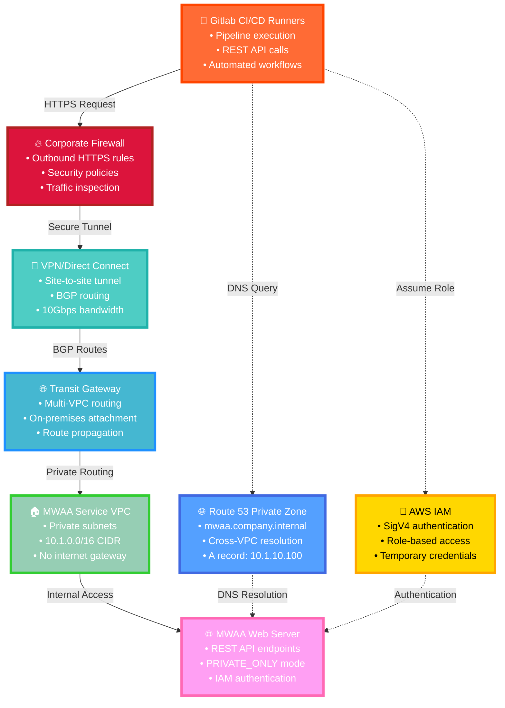
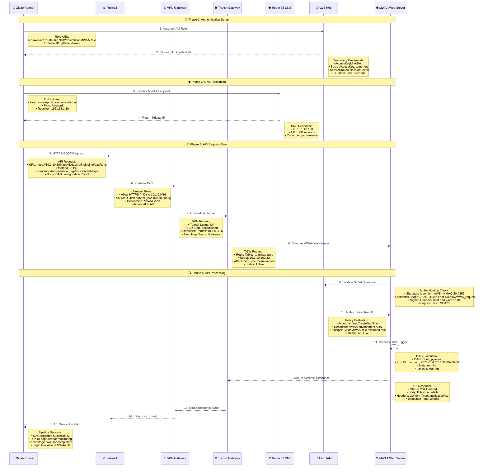
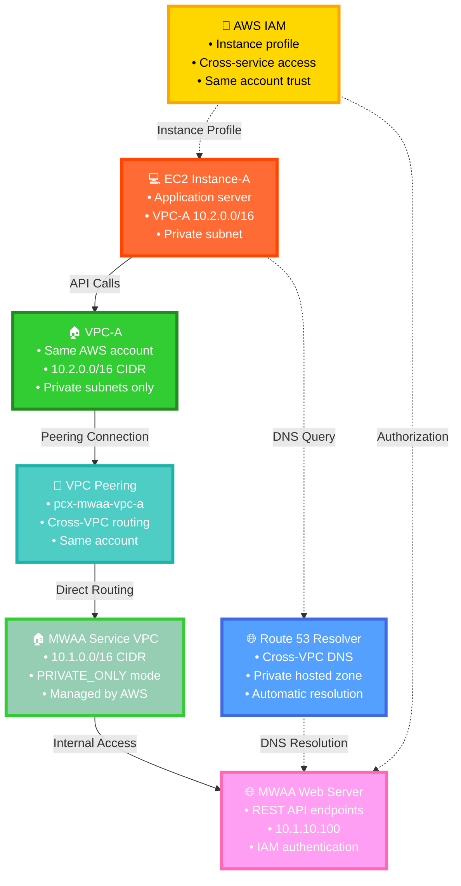
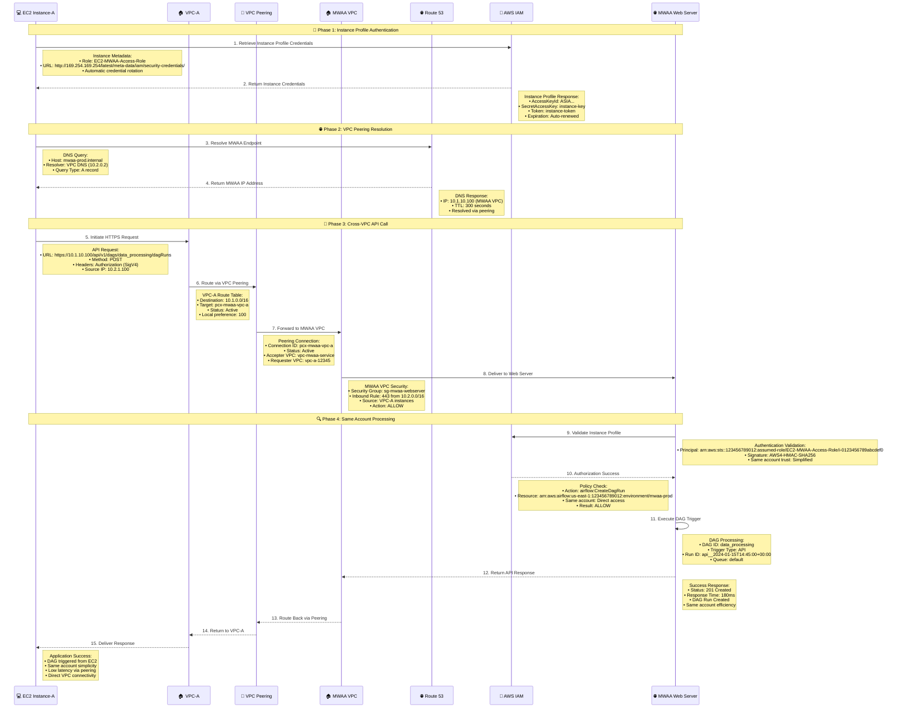
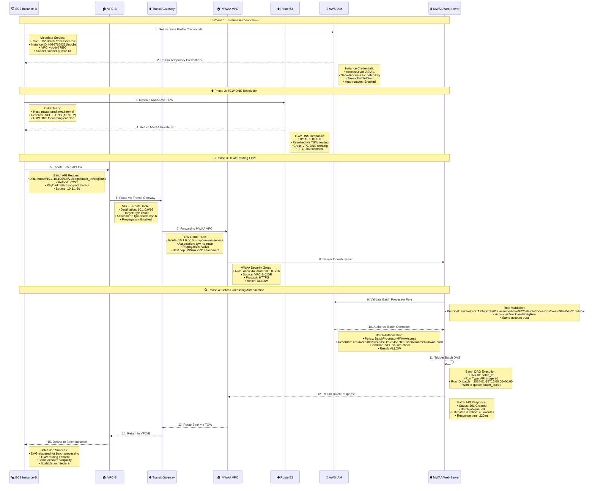
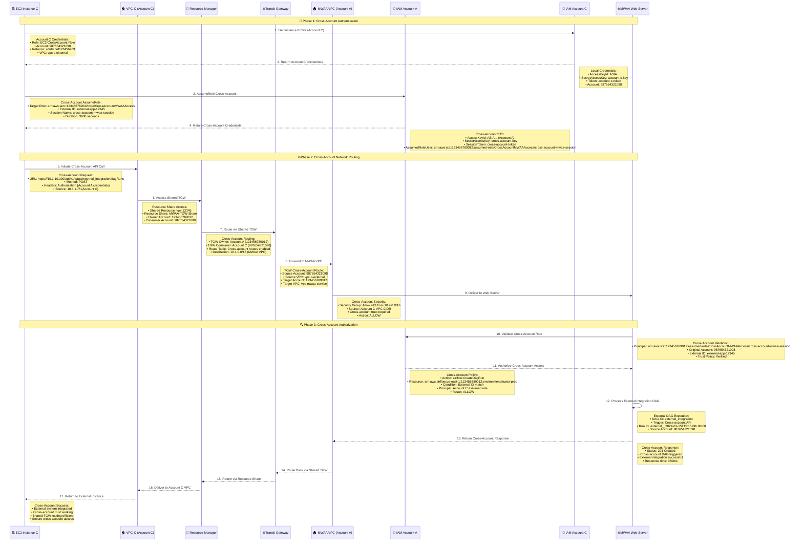
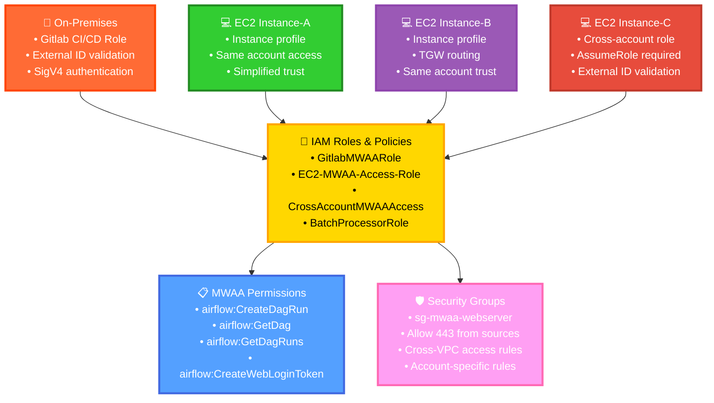
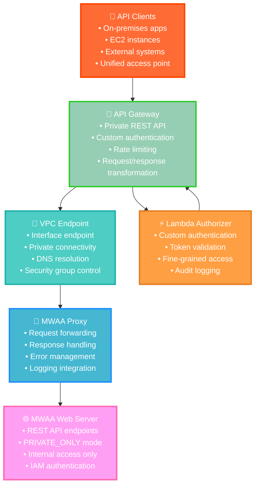
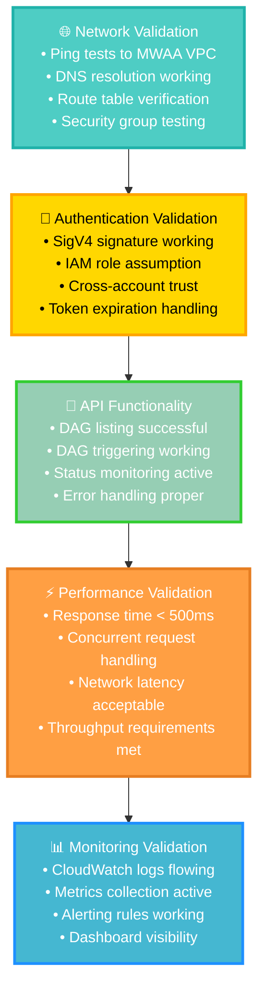

#### 🔧 **Configuration Solutions by Scenario**

**1. Gitlab Runners (On-Premises) → MWAA REST API**

### 🏗️ **Architecture Overview**



### 🔄 **API Call Sequence**



**2. EC2 Instance-A (VPC-A, Same Account) → MWAA REST API**

### 🏗️ **Same Account VPC Architecture**



### 🔄 **Same Account API Sequence**



**3. EC2 Instance-B (VPC-B, Same Account) → MWAA REST API**

### 🏗️ **Transit Gateway Architecture**

```mermaid
graph TB
    EC2B[💻 EC2 Instance-B<br/>• Batch processing<br/>• VPC-B (10.3.0.0/16)<br/>• Private subnet]:::ec2
    VPCB[🏠 VPC-B<br/>• Same AWS account<br/>• 10.3.0.0/16 CIDR<br/>• TGW attachment]:::vpcb
    TGW[🌐 Transit Gateway<br/>• tgw-12345<br/>• Multi-VPC routing<br/>• Route propagation]:::tgw
    MWAAVPC[🏠 MWAA Service VPC<br/>• 10.1.0.0/16 CIDR<br/>• TGW attachment<br/>• Managed service]:::mwaavpc
    WEBSERVER[🌐 MWAA Web Server<br/>• REST API endpoints<br/>• 10.1.10.100<br/>• Cross-VPC access]:::webserver
    ROUTE53[🌐 Route 53 Resolver<br/>• TGW DNS forwarding<br/>• Cross-VPC resolution<br/>• Centralized DNS]:::dns
    IAM[👤 AWS IAM<br/>• Instance profile<br/>• Same account access<br/>• Simplified trust]:::iam
    
    EC2B -->|API Requests| VPCB
    VPCB -->|TGW Attachment| TGW
    TGW -->|Route Propagation| MWAAVPC
    MWAAVPC -->|Internal Access| WEBSERVER
    
    ROUTE53 -.->|DNS Resolution| WEBSERVER
    EC2B -.->|DNS Query| ROUTE53
    IAM -.->|Instance Profile| EC2B
    IAM -.->|Authorization| WEBSERVER
    
    classDef ec2 fill:#FF6B35,stroke:#FF4500,stroke-width:4px,color:#fff
    classDef vpcb fill:#9B59B6,stroke:#8E44AD,stroke-width:4px,color:#fff
    classDef tgw fill:#45B7D1,stroke:#1E90FF,stroke-width:4px,color:#fff
    classDef mwaavpc fill:#96CEB4,stroke:#32CD32,stroke-width:4px,color:#fff
    classDef webserver fill:#FF9FF3,stroke:#FF69B4,stroke-width:4px,color:#fff
    classDef dns fill:#54A0FF,stroke:#4169E1,stroke-width:4px,color:#fff
    classDef iam fill:#FFD700,stroke:#FFA500,stroke-width:4px,color:#000
```

### 🔄 **Transit Gateway API Sequence**



**4. EC2 Instance-C (VPC-C, Different Account) → MWAA REST API**

### 🏗️ **Cross-Account Architecture**

```mermaid
graph TB
    ACCOUNTC[🏢 AWS Account C<br/>• Account ID: 987654321098<br/>• Cross-account access<br/>• Shared TGW attachment]:::accountc
    EC2C[💻 EC2 Instance-C<br/>• External application<br/>• VPC-C (10.4.0.0/16)<br/>• Cross-account role]:::ec2
    VPCC[🏠 VPC-C<br/>• Different AWS account<br/>• 10.4.0.0/16 CIDR<br/>• Shared TGW access]:::vpcc
    RAM[🤝 Resource Access Manager<br/>• Cross-account TGW sharing<br/>• Resource share invitation<br/>• Trust relationship]:::ram
    TGW[🌐 Transit Gateway<br/>• Shared resource<br/>• Cross-account routing<br/>• Account A owned]:::tgw
    ACCOUNTA[🏢 AWS Account A<br/>• Account ID: 123456789012<br/>• MWAA environment<br/>• TGW owner]:::accounta
    MWAAVPC[🏠 MWAA Service VPC<br/>• 10.1.0.0/16 CIDR<br/>• Account A managed<br/>• Cross-account access]:::mwaavpc
    WEBSERVER[🌐 MWAA Web Server<br/>• REST API endpoints<br/>• Cross-account auth<br/>• 10.1.10.100]:::webserver
    IAM[👤 Cross-Account IAM<br/>• AssumeRole trust<br/>• External ID validation<br/>• Cross-account policy]:::iam
    
    ACCOUNTC --> EC2C
    EC2C --> VPCC
    VPCC --> RAM
    RAM --> TGW
    TGW --> ACCOUNTA
    ACCOUNTA --> MWAAVPC
    MWAAVPC --> WEBSERVER
    
    IAM -.->|Cross-Account Trust| EC2C
    IAM -.->|Authorization| WEBSERVER
    
    classDef accountc fill:#E74C3C,stroke:#C0392B,stroke-width:4px,color:#fff
    classDef ec2 fill:#FF6B35,stroke:#FF4500,stroke-width:4px,color:#fff
    classDef vpcc fill:#8E44AD,stroke:#7D3C98,stroke-width:4px,color:#fff
    classDef ram fill:#F39C12,stroke:#E67E22,stroke-width:4px,color:#fff
    classDef tgw fill:#45B7D1,stroke:#1E90FF,stroke-width:4px,color:#fff
    classDef accounta fill:#27AE60,stroke:#229954,stroke-width:4px,color:#fff
    classDef mwaavpc fill:#96CEB4,stroke:#32CD32,stroke-width:4px,color:#fff
    classDef webserver fill:#FF9FF3,stroke:#FF69B4,stroke-width:4px,color:#fff
    classDef iam fill:#FFD700,stroke:#FFA500,stroke-width:4px,color:#000
```

### 🔄 **Cross-Account API Sequence**



#### 🔐 **Authentication & Security Requirements**

### 🛡️ **IAM Configuration Overview**



#### 🚀 **Alternative: API Gateway Integration**

### 🌐 **API Gateway Proxy Architecture**



#### 📋 **Implementation Roadmap**

### 🗺️ **Deployment Strategy Overview**

```mermaid
graph TB
    PHASE1[🔧 Phase 1: Network Foundation<br/>• VPN/Direct Connect setup<br/>• Transit Gateway configuration<br/>• VPC peering (if needed)<br/>• DNS resolution setup]:::phase1
    
    PHASE2[🛡️ Phase 2: Security Configuration<br/>• IAM roles and policies<br/>• Security group rules<br/>• Cross-account trust setup<br/>• External ID validation]:::phase2
    
    PHASE3[🧪 Phase 3: Testing & Validation<br/>• Network connectivity tests<br/>• API authentication tests<br/>• DAG trigger validation<br/>• Performance benchmarking]:::phase3
    
    PHASE4[📊 Phase 4: Monitoring & Operations<br/>• CloudWatch logging<br/>• VPC Flow Logs<br/>• CloudTrail API logging<br/>• Alerting configuration]:::phase4
    
    PHASE5[🚀 Phase 5: Production Migration<br/>• Gitlab CI/CD integration<br/>• Application deployment<br/>• Load testing<br/>• Documentation handover]:::phase5
    
    PHASE1 --> PHASE2
    PHASE2 --> PHASE3
    PHASE3 --> PHASE4
    PHASE4 --> PHASE5
    
    classDef phase1 fill:#FF6B35,stroke:#FF4500,stroke-width:3px,color:#fff
    classDef phase2 fill:#FFD700,stroke:#FFA500,stroke-width:3px,color:#000
    classDef phase3 fill:#32CD32,stroke:#228B22,stroke-width:3px,color:#fff
    classDef phase4 fill:#45B7D1,stroke:#1E90FF,stroke-width:3px,color:#fff
    classDef phase5 fill:#9B59B6,stroke:#8E44AD,stroke-width:3px,color:#fff
```

#### 🎯 **Success Criteria & Validation**

### ✅ **Validation Matrix**



**Key Benefits:**
- **Seamless Migration:** Existing Gitlab CI/CD workflows migrate with minimal changes
- **Security Maintained:** PRIVATE_ONLY mode preserved with proper network access
- **Scalable Architecture:** Supports multiple access patterns and future growth
- **Operational Excellence:** Comprehensive monitoring and troubleshooting capabilities

This architecture enables secure, scalable REST API access to MWAA from various network environments while maintaining the private security posture.
    
    WEBSERVER[🌐 MWAA Web Server<br/>• Airflow REST API<br/>• PRIVATE_ONLY mode<br/>• IAM authentication]:::webserver
    
    DNS[🌐 Route 53 Private Zone<br/>• Internal DNS resolution<br/>• mwaa.company.internal<br/>• Cross-VPC association]:::dns
    
    ONPREM --> FIREWALL
    FIREWALL --> VPN
    VPN --> TGW
    TGW --> MWAAVPC
    MWAAVPC --> WORKERS
    MWAAVPC --> WEBSERVER
    
    DNS -.->|DNS Resolution| WEBSERVER
    ONPREM -.->|DNS Query| DNS
    
    classDef onprem fill:#FF6B6B,stroke:#FF4757,stroke-width:4px,color:#fff
    classDef vpn fill:#4ECDC4,stroke:#26D0CE,stroke-width:4px,color:#fff
    classDef tgw fill:#45B7D1,stroke:#3742FA,stroke-width:4px,color:#fff
    classDef vpc fill:#96CEB4,stroke:#6C5CE7,stroke-width:4px,color:#fff
    classDef workers fill:#FECA57,stroke:#FF9F43,stroke-width:4px,color:#fff
    classDef webserver fill:#FF9FF3,stroke:#F368E0,stroke-width:4px,color:#fff
    classDef dns fill:#54A0FF,stroke:#2F3542,stroke-width:4px,color:#fff
```nation: 10.1.0.0/16 (MWAA VPC)<br/>• Next hop: VPN Gateway<br/>• Protocol: HTTPS (443)<br/>• Source: On-premises subnet
    
    VPN->>TGW: 7. Forward to Transit Gateway
    Note right of VPN: VPN Connection:<br/>• BGP routing enabled<br/>• Advertised routes: 10.1.0.0/16<br/>• Connection status: UP<br/>• Tunnel redundancy: Active
    
    TGW->>MWAAVPC: 8. Route to MWAA VPC
    Note right of TGW: TGW Route Table:<br/>• Route: 10.1.0.0/16 → MWAA VPC<br/>• Propagation: Enabled<br/>• Association: MWAA VPC attachment<br/>• Status: Active
    
    MWAAVPC->>WebServer: 9. Direct connection to MWAA Web Server
    Note right of MWAAVPC: VPC Routing:<br/>• Security Group: Allow 443 from on-premises<br/>• NACL: Allow HTTPS traffic<br/>• Private subnet routing<br/>• No NAT Gateway required
    
    Note over OnPrem,IAM: 🔍 Phase 3: API Processing & Response
    
    WebServer->>IAM: 10. Validate API Request
    Note right of WebServer: API Validation:<br/>• AWS Signature V4 verification<br/>• IAM policy evaluation<br/>• Resource-based permissions<br/>• Rate limiting check
    
    IAM-->>WebServer: 11. Authorization Result
    Note right of IAM: Authorization Check:<br/>• Action: airflow:CreateDagRun<br/>• Resource: arn:aws:airflow:region:account:environment/env-name<br/>• Principal: assumed role ARN<br/>• Result: Allow/Deny
    
    WebServer->>WebServer: 12. Process DAG Trigger Request
    Note right of WebServer: DAG Processing:<br/>• Validate DAG exists<br/>• Check DAG is not paused<br/>• Create DAG run instance<br/>• Queue tasks for execution
    
    WebServer-->>MWAAVPC: 13. Return API Response
    Note right of WebServer: API Response:<br/>• Status: 200 OK<br/>• Body: DAG run details<br/>• Headers: Content-Type, CORS<br/>• Run ID: manual__2024-01-15T10:30:00
    
    MWAAVPC-->>TGW: 14. Route response back
    TGW-->>VPN: 15. Forward via Transit Gateway
    VPN-->>Firewall: 16. Return via VPN/Direct Connect
    Firewall-->>OnPrem: 17. Deliver API Response
    
    Note right of OnPrem: Response Received:<br/>• DAG triggered successfully<br/>• Run ID for tracking<br/>• Execution timestamp<br/>• Direct MWAA access confirmed
```
